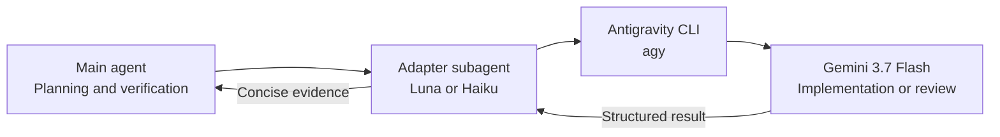

# Antigravity Delegation for Codex and Claude Code

**English** | [Türkçe](README.tr.md)

Delegate bounded coding, review, debugging, or architecture tasks from **OpenAI Codex** or **Claude Code** to Google Antigravity CLI. The host agent plans and verifies; Antigravity supplies an independent implementation or second opinion.



## How it works

- Codex uses a project skill plus a `gpt-5.6-luna` adapter with low reasoning.
- Claude Code uses a forked skill plus a `haiku` adapter with low effort.
- Both adapters default to `gemini-3.7-flash-high` for substantive work.
- `consult` and `review` are read-only; `implement` allows only explicitly scoped edits.
- The main agent inspects the relevant context, writes the complete Antigravity prompt, and verifies the result before accepting it.

Codex and Claude Code need separate wrappers because their custom-agent mechanisms differ. The workflow and safety rules remain equivalent.

## Files

```text
.agents/skills/antigravity-delegation/SKILL.md   # Codex skill
.codex/agents/antigravity.toml                   # Codex adapter
.claude/skills/antigravity-delegation/SKILL.md   # Claude Code skill
.claude/agents/antigravity.md                    # Claude Code adapter
```

## Requirements

- Google Antigravity CLI installed and authenticated
- `agy` available on `PATH`
- Codex, Claude Code, or both
- Git for diff verification in implementation tasks

Confirm Antigravity is ready:

```bash
agy models
```

## Installation

### Project-scoped

Copy the relevant hidden directories into your project root:

| Host | Required files |
|---|---|
| Codex | `.agents/skills/antigravity-delegation/SKILL.md` and `.codex/agents/antigravity.toml` |
| Claude Code | `.claude/skills/antigravity-delegation/SKILL.md` and `.claude/agents/antigravity.md` |

Keep all four files when using both hosts. Start a new host session after installing or changing an agent definition.

### Global

Codex:

```bash
mkdir -p ~/.agents/skills/antigravity-delegation ~/.codex/agents
cp .agents/skills/antigravity-delegation/SKILL.md ~/.agents/skills/antigravity-delegation/SKILL.md
cp .codex/agents/antigravity.toml ~/.codex/agents/antigravity.toml
```

Claude Code:

```bash
mkdir -p ~/.claude/skills/antigravity-delegation ~/.claude/agents
cp .claude/skills/antigravity-delegation/SKILL.md ~/.claude/skills/antigravity-delegation/SKILL.md
cp .claude/agents/antigravity.md ~/.claude/agents/antigravity.md
```

Restart the host session after installation.

## Usage

Choose one mode:

| Mode | Behavior | Typical use |
|---|---|---|
| `consult` | Read-only | Architecture, planning, debugging hypotheses |
| `review` | Read-only | Diff, correctness, security, or test review |
| `implement` | Scoped writes | A bounded fix, refactor, or candidate implementation |

### Codex

Ask naturally:

```text
Use the antigravity-delegation skill in review mode.
Ask Antigravity to review the authentication changes for correctness,
race conditions, and missing tests. Verify its findings yourself.
```

### Claude Code

Invoke the skill directly:

```text
/antigravity-delegation mode: review
prompt: |
  Review the authentication changes for concurrency bugs.
  Inspect src/auth/ and tests/auth/. Do not modify files.
  Return findings ranked by severity with file references and concrete evidence.
```

The main agent must inspect the relevant repository context and write the complete,
ready-to-send Antigravity prompt. The adapter transports that prompt; it does not
discover missing context or rewrite the task.

Work-order fields:

```text
mode: consult | review | implement
prompt: complete prompt containing the objective, relevant context and paths,
        constraints, evidence, required output, and write rules
antigravity_model: optional model override
effort: low | medium | high
```

## Models

| Role | Default |
|---|---|
| Codex adapter | `gpt-5.6-luna`, low reasoning |
| Claude Code adapter | `haiku`, low effort |
| Antigravity worker | `gemini-3.7-flash-high` |

Override the worker only when needed:

```text
antigravity_model: gemini-3.7-flash-medium
```

Run `agy models` for currently available slugs. An invalid pinned model fails loudly instead of silently selecting another model.

If a Codex runtime rejects the Luna override, remove these lines from `.codex/agents/antigravity.toml` so the adapter inherits the parent configuration:

```toml
model = "gpt-5.6-luna"
model_reasoning_effort = "low"
```

## Workspace, permissions, and verification

Every adapter invocation includes:

```bash
--add-dir "$PWD"
```

This makes the host's current project the active Antigravity workspace even when the CLI retained another project from an earlier session.

Headless shell commands that require approval must be allowed explicitly in `~/.gemini/antigravity-cli/settings.json`. Keep permissions narrow:

```json
{
  "permissions": {
    "allow": [
      "command(git (status|diff|rev-parse))",
      "command(npm run (build|lint|test))"
    ]
  }
}
```

Replace the project-command rule as needed. A matching `deny` or `ask` rule takes precedence over `allow`.

The adapters do not enable `--dangerously-skip-permissions`. They also prohibit commits, pushes, merges, deployments, publishing, branch deletion, and remote-state changes unless the parent task explicitly authorizes them.

An Antigravity run is successful only when the process exits successfully, JSON `status` is `SUCCESS`, and `response` is non-empty. The main agent must still verify important claims against the repository, diff, tests, logs, or authoritative documentation.

## Troubleshooting

### `agy: command not found`

```bash
which agy
agy models
```

Run these from the environment that launches Codex or Claude Code.

### Antigravity returns `ERROR` or `BLOCKED`

Check the process exit code, `stderr`, JSON `error`, requested model slug, and Antigravity permission policy. Configure the narrowest missing permission instead of bypassing checks.

### The host cannot find the skill or adapter

Confirm the appropriate project or global paths from the installation table, then start a new host session. In Claude Code, inspect `/skills` and `/agents`.

## Documentation

- [Antigravity headless mode](https://antigravity.google/docs/cli/headless/)
- [Antigravity permissions](https://antigravity.google/docs/cli/permissions/)
- [Codex subagents](https://learn.chatgpt.com/docs/agent-configuration/subagents)
- [Claude Code skills](https://code.claude.com/docs/en/slash-commands)
- [Claude Code subagents](https://code.claude.com/docs/en/sub-agents)
