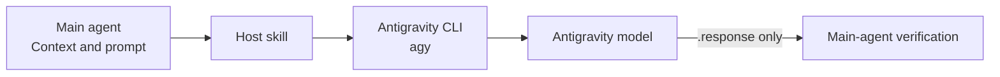

# Antigravity Delegation for Codex and Claude Code

**English** | [Türkçe](README.tr.md)

Send bounded coding, review, debugging, or architecture tasks directly from
**OpenAI Codex** or **Claude Code** to Google Antigravity CLI. The main host agent
selects context, invokes `agy`, and verifies the external answer without an
intermediate subagent.



## How it works

- Codex and Claude Code use the same canonical skill in the main conversation.
- Both hosts read the repository's single `SKILL.md`.
- The skill sends one self-contained prompt to `agy --output-format json`.
- A clean run must have a successful process exit, JSON `status: SUCCESS`, a
  non-empty `response`, and no permission-denial diagnostic.
- Only `.response` is exposed on success. The JSON envelope, usage, thinking-token
  count, conversation ID, progress, and stderr stay out of the host tool result.
- `consult` and `review` are read-only; `implement` allows only explicitly scoped edits.
- The main agent verifies material claims and any workspace changes before accepting them.

## Files

```text
SKILL.md  # Shared skill definition
```

## Requirements

- Google Antigravity CLI installed and authenticated
- `agy` available on `PATH`
- `jq` for JSON validation and response extraction
- Codex, Claude Code, or both
- Git for diff verification in implementation tasks

Confirm the local tools are ready:

```bash
agy models
jq --version
```

## Installation

Use the repository-root `SKILL.md` with either Codex or Claude Code. The
repository intentionally contains no host-specific skill or agent definitions.

### Upgrading from an earlier version

Remove any previously installed host-specific skill copies and obsolete
subagent definitions, then use the shared `SKILL.md`. The repository does not
modify global Codex or Claude Code configuration automatically.

## Usage

Choose one mode:

| Mode | Behavior | Typical use |
|---|---|---|
| `consult` | Read-only | Architecture, planning, debugging hypotheses |
| `review` | Read-only | Diff, correctness, security, or test review |
| `implement` | Scoped writes | A bounded fix, refactor, or candidate implementation |

### Codex

Ask naturally:

```text
Use the antigravity-delegation skill in review mode.
Ask Antigravity to review the authentication changes for correctness,
race conditions, and missing tests. Verify its findings yourself.
```

### Claude Code

Invoke the skill directly:

```text
/antigravity-delegation mode: review
prompt: |
  Review the authentication changes for concurrency bugs.
  Inspect src/auth/ and tests/auth/. Do not modify files.
  Return findings ranked by severity with file references and concrete evidence.
```

The main agent inspects the relevant repository context and writes the complete,
ready-to-send prompt before invoking Antigravity.

Work-order fields:

```text
mode: consult | review | implement
prompt: complete prompt containing the objective, relevant context and paths,
        constraints, evidence, required output, and write rules
antigravity_model: optional base model override
effort: low | medium | high
```

The skill passes the base model and reasoning effort separately.

## Model

| Role | Default |
|---|---|
| Antigravity worker | `gemini-3.7-flash` with `effort: high` |

Override the worker only when needed:

```text
antigravity_model: gemini-3.7-flash
effort: medium
```

Run `agy models` for currently available model and effort combinations. An
invalid pinned model fails loudly instead of silently selecting another model.

## Workspace, permissions, and verification

Every invocation includes:

```bash
--add-dir "$PWD"
```

This makes the host's current project available to Antigravity even when the CLI
retained another project from an earlier session.

Headless shell commands that require approval must be allowed explicitly in
`~/.gemini/antigravity-cli/settings.json`. Keep permissions narrow:

```json
{
  "permissions": {
    "allow": [
      "command(git (status|diff|rev-parse))",
      "command(npm run (build|lint|test))"
    ]
  }
}
```

Replace the project-command rule as needed. Do not use
`--dangerously-skip-permissions` merely to bypass a blocked call.

The main agent must still verify important claims against the repository, diff,
tests, logs, or authoritative documentation. A returned `SUCCESS` is not proof
that Antigravity's conclusions are correct.

## Troubleshooting

### `agy: command not found`

```bash
which agy
agy models
```

Run these from the environment that launches Codex or Claude Code.

### Antigravity returns `ERROR` or `BLOCKED`

Check the process exit code, JSON `error`, requested model, and Antigravity
permission policy. Configure the narrowest missing permission instead of
bypassing checks.

### The host cannot find the skill

Confirm that the host loaded `SKILL.md`, then start a new host session. In Claude
Code, inspect `/skills`.

## Documentation

- [Antigravity headless mode](https://antigravity.google/docs/cli/headless/)
- [Antigravity permissions](https://antigravity.google/docs/cli/permissions/)
- [Codex skills](https://learn.chatgpt.com/docs/build-skills)
- [Claude Code skills](https://code.claude.com/docs/en/skills)
