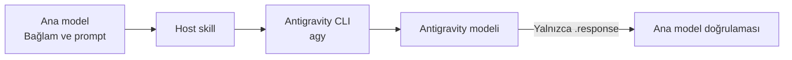

# Codex ve Claude Code için Antigravity Delegation

[English](README.md) | **Türkçe**

Sınırları belirlenmiş kodlama, review, debugging veya mimari görevlerini **OpenAI
Codex** ya da **Claude Code** ana modelinden doğrudan Google Antigravity CLI'ye
gönderir. Ana model bağlamı seçer, `agy` çağrısını yapar ve harici cevabı arada
sub-agent olmadan doğrular.



## Nasıl çalışır?

- Codex ve Claude Code ana konuşmada host'a özgü bir skill kullanır.
- Skill, `agy --output-format json` ile tek ve eksiksiz bir prompt gönderir.
- Temiz bir çalıştırma; başarılı process exit, JSON `status: SUCCESS`, boş olmayan
  `response` ve permission-denial içermeyen stderr gerektirir.
- Başarıda yalnızca `.response` gösterilir. JSON zarfı, kullanım verisi,
  thinking-token sayısı, conversation ID, ilerleme ve stderr host tool sonucuna girmez.
- `consult` ve `review` read-only'dir; `implement` yalnızca açıkça sınırlandırılmış değişikliklere izin verir.
- Ana model önemli iddiaları ve workspace değişikliklerini kabul etmeden önce doğrular.

## Dosyalar

```text
.agents/skills/antigravity-delegation/SKILL.md   # Codex skill
.claude/skills/antigravity-delegation/SKILL.md  # Claude Code skill
```

## Gereksinimler

- Google Antigravity CLI kurulu ve authenticate edilmiş olmalı
- `agy` komutu `PATH` üzerinde bulunmalı
- JSON doğrulama ve response extraction için `jq`
- Codex, Claude Code veya ikisi birden
- Implementation görevlerinde diff doğrulaması için Git

Yerel araçları doğrula:

```bash
agy models
jq --version
```

## Kurulum

### Proje bazlı

İlgili skill dizinini projenin root dizinine kopyala:

| Host | Gerekli dosya |
|---|---|
| Codex | `.agents/skills/antigravity-delegation/SKILL.md` |
| Claude Code | `.claude/skills/antigravity-delegation/SKILL.md` |

İki host'u da kullanıyorsan iki skill dosyasını da tut. Kurulumdan veya skill
değişikliğinden sonra yeni bir host session başlat.

### Global

Codex:

```bash
mkdir -p ~/.agents/skills/antigravity-delegation
cp .agents/skills/antigravity-delegation/SKILL.md \
  ~/.agents/skills/antigravity-delegation/SKILL.md
```

Claude Code:

```bash
mkdir -p ~/.claude/skills/antigravity-delegation
cp .claude/skills/antigravity-delegation/SKILL.md \
  ~/.claude/skills/antigravity-delegation/SKILL.md
```

### Sub-agent sürümünden yükseltme

Yeni skill'leri kopyaladıktan sonra eski kurulu agent tanımlarını kaldır:

```bash
rm ~/.codex/agents/antigravity.toml
rm ~/.claude/agents/antigravity.md
```

Yalnızca daha önce kurduğun dosyanın komutunu çalıştır. Repository global Codex
veya Claude Code konfigürasyonunu otomatik olarak değiştirmez.

## Kullanım

Bir mod seç:

| Mod | Davranış | Tipik kullanım |
|---|---|---|
| `consult` | Read-only | Mimari, planlama, debugging hipotezleri |
| `review` | Read-only | Diff, doğruluk, güvenlik veya test incelemesi |
| `implement` | Sınırlandırılmış yazma | Bounded fix, refactor veya aday implementation |

### Codex

Doğal dille iste:

```text
Use the antigravity-delegation skill in review mode.
Ask Antigravity to review the authentication changes for correctness,
race conditions, and missing tests. Verify its findings yourself.
```

### Claude Code

Skill'i doğrudan çağır:

```text
/antigravity-delegation mode: review
prompt: |
  Kimlik doğrulama değişikliklerini concurrency bug'ları için incele.
  src/auth/ ve tests/auth/ yollarını incele. Dosyaları değiştirme.
  Bulguları dosya referansları ve somut kanıtlarla önem sırasına göre döndür.
```

Ana model ilgili repository bağlamını inceler ve Antigravity'yi çağırmadan önce
doğrudan gönderilmeye hazır, eksiksiz promptu yazar.

Work-order alanları:

```text
mode: consult | review | implement
prompt: amaç, ilgili bağlam ve yollar, kısıtlar, kanıtlar, beklenen çıktı ve
        yazma kurallarını içeren eksiksiz prompt
antigravity_model: isteğe bağlı temel model override'ı
effort: low | medium | high
```

Skill temel modeli ve reasoning effort seviyesini ayrı parametreler olarak geçirir.

## Model

| Rol | Varsayılan |
|---|---|
| Antigravity worker | `gemini-3.7-flash`, `effort: high` |

Worker modelini yalnızca gerektiğinde değiştir:

```text
antigravity_model: gemini-3.7-flash
effort: medium
```

Güncel model ve effort kombinasyonları için `agy models` çalıştır. Geçersiz bir
pinned model, sessizce başka model seçmek yerine açıkça hata verir.

## Workspace, izinler ve doğrulama

Her çağrı şunu içerir:

```bash
--add-dir "$PWD"
```

Böylece CLI önceki bir session'dan farklı bir proje tutmuş olsa bile host'un
mevcut projesi Antigravity tarafından erişilebilir olur.

Onay gerektiren headless shell komutları `~/.gemini/antigravity-cli/settings.json`
içinde açıkça izinli olmalıdır. İzinleri dar tut:

```json
{
  "permissions": {
    "allow": [
      "command(git (status|diff|rev-parse))",
      "command(npm run (build|lint|test))"
    ]
  }
}
```

Proje komutu kuralını gerektiği gibi değiştir. Engellenmiş bir çağrıyı bypass
etmek için `--dangerously-skip-permissions` kullanma.

Ana model önemli iddiaları repository, diff, testler, loglar veya otoritatif
dokümantasyon üzerinden yine doğrulamalıdır. Dönen `SUCCESS`, Antigravity'nin
sonuçlarının doğru olduğunun kanıtı değildir.

## Sorun giderme

### `agy: command not found`

```bash
which agy
agy models
```

Bu komutları Codex veya Claude Code'u başlatan environment içinde çalıştır.

### Antigravity `ERROR` veya `BLOCKED` döndürüyor

Process exit code, JSON `error`, istenen model ve Antigravity permission
policy'yi kontrol et. Kontrolleri bypass etmek yerine eksik olan en dar izni yapılandır.

### Host skill'i bulamıyor

İlgili proje veya global skill path'ini doğrula ve yeni bir host session başlat.
Claude Code tarafında `/skills` ekranını kontrol et.

## Dokümantasyon

- [Antigravity headless mode](https://antigravity.google/docs/cli/headless/)
- [Antigravity permissions](https://antigravity.google/docs/cli/permissions/)
- [Codex skills](https://learn.chatgpt.com/docs/build-skills)
- [Claude Code skills](https://code.claude.com/docs/en/skills)
