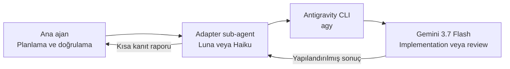

# Codex ve Claude Code için Antigravity Delegation

[English](README.md) | **Türkçe**

Sınırları belirlenmiş kodlama, review, debugging veya mimari görevlerini **OpenAI Codex** ya da **Claude Code** üzerinden Google Antigravity CLI'ye delege eder. Ana ajan planlar ve doğrular; Antigravity bağımsız bir implementation veya ikinci görüş üretir.



## Nasıl çalışır?

- Codex, proje skill'i ile low reasoning kullanan bir `gpt-5.6-luna` adapter çalıştırır.
- Claude Code, fork edilmiş skill ile low effort kullanan bir `haiku` adapter çalıştırır.
- İki adapter da asıl iş için varsayılan olarak `gemini-3.7-flash-high` kullanır.
- `consult` ve `review` read-only'dir; `implement` yalnızca açıkça sınırlandırılmış değişikliklere izin verir.
- Ana ajan ilgili bağlamı inceler, eksiksiz Antigravity promptunu yazar ve sonucu kabul etmeden önce doğrular.

Codex ve Claude Code'un custom-agent mekanizmaları farklı olduğu için ayrı wrapper'lar gerekir. Workflow ve güvenlik kuralları ise aynıdır.

## Dosyalar

```text
.agents/skills/antigravity-delegation/SKILL.md   # Codex skill
.codex/agents/antigravity.toml                   # Codex adapter
.claude/skills/antigravity-delegation/SKILL.md   # Claude Code skill
.claude/agents/antigravity.md                    # Claude Code adapter
```

## Gereksinimler

- Google Antigravity CLI kurulu ve authenticate edilmiş olmalı
- `agy` komutu `PATH` üzerinde bulunmalı
- Codex, Claude Code veya ikisi birden
- Implementation görevlerinde diff doğrulaması için Git

Antigravity'nin hazır olduğunu doğrula:

```bash
agy models
```

## Kurulum

### Proje bazlı

İlgili gizli klasörleri projenin root dizinine kopyala:

| Host | Gerekli dosyalar |
|---|---|
| Codex | `.agents/skills/antigravity-delegation/SKILL.md` ve `.codex/agents/antigravity.toml` |
| Claude Code | `.claude/skills/antigravity-delegation/SKILL.md` ve `.claude/agents/antigravity.md` |

İki host'u da kullanıyorsan dört dosyanın tamamını tut. Kurulumdan veya agent tanımı değişikliğinden sonra yeni bir host session başlat.

### Global

Codex:

```bash
mkdir -p ~/.agents/skills/antigravity-delegation ~/.codex/agents
cp .agents/skills/antigravity-delegation/SKILL.md ~/.agents/skills/antigravity-delegation/SKILL.md
cp .codex/agents/antigravity.toml ~/.codex/agents/antigravity.toml
```

Claude Code:

```bash
mkdir -p ~/.claude/skills/antigravity-delegation ~/.claude/agents
cp .claude/skills/antigravity-delegation/SKILL.md ~/.claude/skills/antigravity-delegation/SKILL.md
cp .claude/agents/antigravity.md ~/.claude/agents/antigravity.md
```

Kurulumdan sonra host session'ını yeniden başlat.

## Kullanım

Bir mod seç:

| Mod | Davranış | Tipik kullanım |
|---|---|---|
| `consult` | Read-only | Mimari, planlama, debugging hipotezleri |
| `review` | Read-only | Diff, doğruluk, güvenlik veya test incelemesi |
| `implement` | Sınırlandırılmış yazma | Bounded fix, refactor veya aday implementation |

### Codex

Doğal dille iste:

```text
Use the antigravity-delegation skill in review mode.
Ask Antigravity to review the authentication changes for correctness,
race conditions, and missing tests. Verify its findings yourself.
```

### Claude Code

Skill'i doğrudan çağır:

```text
/antigravity-delegation mode: review
prompt: |
  Kimlik doğrulama değişikliklerini concurrency bug'ları için incele.
  src/auth/ ve tests/auth/ yollarını incele. Dosyaları değiştirme.
  Bulguları dosya referansları ve somut kanıtlarla önem sırasına göre döndür.
```

Ana ajan ilgili repository bağlamını incelemeli ve doğrudan Antigravity'ye
gönderilmeye hazır, eksiksiz promptu yazmalıdır. Adapter bu promptu taşır; eksik
bağlamı keşfetmez veya görevi yeniden yazmaz.

Work-order alanları:

```text
mode: consult | review | implement
prompt: amaç, ilgili bağlam ve yollar, kısıtlar, kanıtlar, beklenen çıktı ve
        yazma kurallarını içeren eksiksiz prompt
antigravity_model: isteğe bağlı model override'ı
effort: low | medium | high
```

## Modeller

| Rol | Varsayılan |
|---|---|
| Codex adapter | `gpt-5.6-luna`, low reasoning |
| Claude Code adapter | `haiku`, low effort |
| Antigravity worker | `gemini-3.7-flash-high` |

Worker modelini yalnızca gerektiğinde değiştir:

```text
antigravity_model: gemini-3.7-flash-medium
```

Güncel model slug'ları için `agy models` çalıştır. Geçersiz bir pinned model, sessizce başka model seçmek yerine açıkça hata verir.

Codex runtime Luna override'ını reddederse adapter'ın parent konfigürasyonunu inherit etmesi için `.codex/agents/antigravity.toml` içindeki şu satırları kaldır:

```toml
model = "gpt-5.6-luna"
model_reasoning_effort = "low"
```

## Workspace, izinler ve doğrulama

Her adapter çağrısı şunu içerir:

```bash
--add-dir "$PWD"
```

Böylece CLI önceki bir session'dan farklı bir proje tutmuş olsa bile host'un mevcut projesi aktif Antigravity workspace'i olur.

Onay gerektiren headless shell komutları `~/.gemini/antigravity-cli/settings.json` içinde açıkça izinli olmalıdır. İzinleri dar tut:

```json
{
  "permissions": {
    "allow": [
      "command(git (status|diff|rev-parse))",
      "command(npm run (build|lint|test))"
    ]
  }
}
```

Proje komutu kuralını gerektiği gibi değiştir. Eşleşen bir `deny` veya `ask` kuralı `allow` kuralından önceliklidir.

Adapter'lar `--dangerously-skip-permissions` kullanmaz. Parent görev açıkça yetki vermedikçe commit, push, merge, deployment, yayınlama, branch silme ve remote-state değişikliklerini de yasaklar.

Bir Antigravity çalıştırması yalnızca process başarıyla sonlandığında, JSON `status` değeri `SUCCESS` olduğunda ve `response` boş olmadığında başarılıdır. Ana ajan yine de önemli iddiaları repository, diff, testler, loglar veya otoritatif dokümantasyon üzerinden doğrulamalıdır.

## Sorun giderme

### `agy: command not found`

```bash
which agy
agy models
```

Bu komutları Codex veya Claude Code'u başlatan environment içinde çalıştır.

### Antigravity `ERROR` veya `BLOCKED` döndürüyor

Process exit code, `stderr`, JSON `error`, istenen model slug'ı ve Antigravity permission policy'yi kontrol et. Kontrolleri bypass etmek yerine eksik olan en dar izni yapılandır.

### Host skill veya adapter'ı bulamıyor

Kurulum tablosundaki proje ya da global path'leri doğrula ve yeni bir host session başlat. Claude Code tarafında `/skills` ve `/agents` ekranlarını kontrol et.

## Dokümantasyon

- [Antigravity headless mode](https://antigravity.google/docs/cli/headless/)
- [Antigravity permissions](https://antigravity.google/docs/cli/permissions/)
- [Codex subagents](https://learn.chatgpt.com/docs/agent-configuration/subagents)
- [Claude Code skills](https://code.claude.com/docs/en/slash-commands)
- [Claude Code subagents](https://code.claude.com/docs/en/sub-agents)
